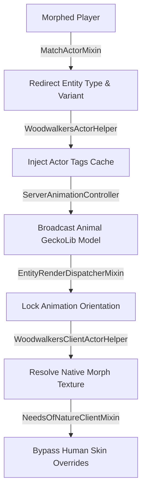

# Needs of Nature × Woodwalkers Bridge (`non_woodwalkers_bridge`)

<div align="center">
  <a href="https://github.com/DeconstructedCube/non_identity2_bridge/releases/latest"></a>
  <a href="https://minecraft.net/"></a>
  <a href="https://fabricmc.net/"></a>
  <a href="https://adoptium.net/"></a>
  <a href="LICENSE"></a>
</div>

---

A Fabric compatibility layer between **Needs of Nature (NoN)** and **Woodwalkers**.

## Technical Details

This bridge resolves conflicts between NoN's player-centric animation and rendering assumptions and Woodwalkers' morph mechanics:

- 🔄 **Entity Matching**: Intercepts `entity.getType()`, `isBaby()`, and `EntityVariants.resolveVariant()` to return the morph's data instead of `minecraft:player`. This ensures NoN assigns animal animation clips (e.g., `p1_fox`) instead of human clips during multi-actor animations.
- 🖼️ **Texture Resolution**: Reuses NoN's `RenderState` and utilizes generic type erasure via `LivingEntityRenderer` to extract vanilla morph textures (including variants and resource packs) without reflection.
- 🛑 **Render State Correction**: Bypasses NoN's `resolveDestroyedSkinBaseTexture` and skin-part cube-hiding for morphed players, preventing human textures from being mapped onto animal models.
- 📌 **Orientation Lock**: Locks `bodyRot`, `yRot`, and `xRot` on the client render state to the animation's anchor orientation, preventing the model from rotating with the camera.
- 💾 **Actor Tags Cache**: Implements a concurrent cache for morph actor tags (`actor.morph`, `actor.feral`, gender traits) to prevent allocation overhead during tick scans.
- ⚙️ **Mixin Compliance**: Targets standard Minecraft classes and public classes with deterministic ordering (`priority = 1500`) to minimize mixin conflicts.

## Architecture Pipeline



---
## 📦 Requirements

| Component | Minimum Version | Note |
| :--- | :--- | :--- |
| **Minecraft** | `~1.21.11` | Fabric Environment |
| **Fabric Loader** | `>=0.18.2` | |
| **Needs of Nature (NoN)** | `>=1.5.0` | Required |
| **Woodwalkers** | `>=7.0.0` | Required |

---

## 🚀 Building from Source
```bash
git clone https://github.com/DeconstructedCube/non_identity2_bridge.git
cd non_identity2_bridge
./gradlew build
```

---

## 📜 License

This project is licensed under the terms of the [GNU General Public License v3.0](LICENSE).
