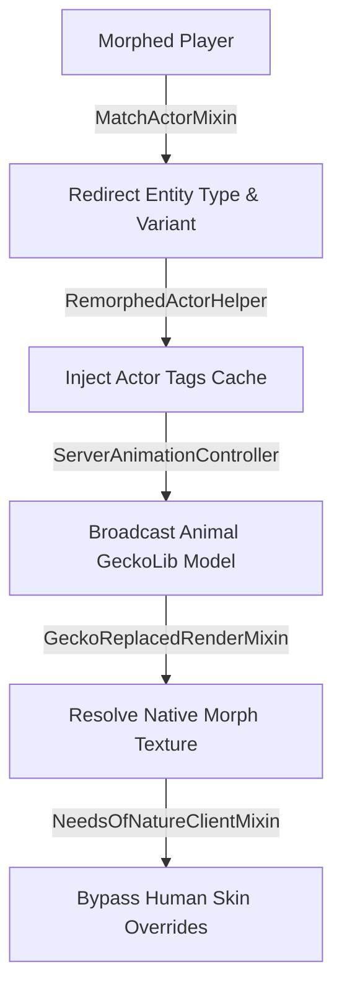

# Needs of Nature × ReMorphed Bridge (`non_remorphed_bridge`)

<div align="center">
  <a href="https://github.com/DeconstructedCube/non_identity2_bridge/releases/latest"></a>
  <a href="https://minecraft.net/"></a>
  <a href="https://fabricmc.net/"></a>
  <a href="https://adoptium.net/"></a>
  <a href="LICENSE"></a>
</div>

---

A Fabric compatibility layer between **Needs of Nature (NoN)** and **ReMorphed**.

## Technical Details

This bridge resolves conflicts between NoN's player-centric animation and rendering assumptions and ReMorphed's morph mechanics:

- 🔄 **Entity Matching**: Intercepts `entity.getType()`, `isBaby()`, and `EntityVariants.resolveVariant()` to return the morph's data instead of `minecraft:player`. This ensures NoN assigns animal animation clips (e.g., `p1_fox`) instead of human clips during multi-actor animations.
- 🖼️ **Texture Resolution**: Directly queries the vanilla `LivingEntityRenderer.getTextureLocation` via runtime render state for morph textures (including variants and resource packs) with zero reflection and zero deceptive fallbacks.
- 🛑 **Render State Correction**: Bypasses NoN's `resolveDestroyedSkinBaseTexture` and skin-part cube-hiding for morphed players, preventing human textures from being mapped onto animal models.
- 💾 **Actor Tags Cache**: Implements a concurrent cache for morph actor tags (`actor.morph`, `actor.feral`, gender traits) to prevent allocation overhead during tick scans.
- ⚙️ **Mixin Compliance**: Targets standard Minecraft classes and public classes with deterministic ordering (`priority = 1500`) to minimize mixin conflicts.

## Architecture Pipeline



---

## 📦 Requirements

| Component | Minimum Version | Note |
| :--- | :--- | :--- |
| **Minecraft** | `~1.21.11` | Fabric Environment |
| **Fabric Loader** | `>=0.18.2` | |
| **Fabric API** | `*` | Required |
| **Needs of Nature (NoN)** | `>=1.5.0` | Required |
| **ReMorphed** | `>=7.0.0` | Required |

---

## 🧪 Verification & Test Suite Checklist

### 1. Animation Matching & 1.21.11 Variant Rendering
- [ ] **Wolf (9 Variants & Collar)**: Verify that all 1.21.11 wolf variants (ashen, black, rusty, snowy, etc.) and dyed collars render without missing textures in animal animations.
- [ ] **Cat & Axolotl**: Verify that multi-color registry variants render accurately without reverting to default skins.
- [ ] **Sheep & Fox**: Verify that quadruped interaction/mating animations are selected correctly instead of falling back to human animations.
- [ ] **Baby Mobs**: Verify that baby shapes (e.g., baby rabbit/baby wolf) enforce baby check constraints and filter out incompatible animations.
- [ ] **Hostile & Humanoid Mobs (Zombie, Skeleton, Enderman)**: Verify attack/defeated animations and confirm camera orientation decoupling operates normally.
- [ ] **Resource Packs**: Verify that custom high-resolution mob textures are loaded dynamically by the renderer.

### 2. Physiology, Liquid Attribution & Horse Collector
- [ ] **Horse Liquid Collector (Equine Morph)**: Verify that morphed stallions (Horse, Donkey, Mule) successfully fill the collector on peak and emit full drip particles.
- [ ] **Collector Bottling**: Verify that right-clicking a full collector with an empty glass bottle yields a `Horse Liquid Bottle`.
- [ ] **Liquid Donor Attribution**: Verify that peak liquid produced by morphed entities (e.g., wolf, horse) records the correct entity ID in the receiver's tank.
- [ ] **Player Tank Extraction**: Verify that sneaking and right-clicking with a glass bottle extracts the morph's specific entity liquid bottle.
- [ ] **Bee (Honey Special Composition)**: Verify that liquid produced by bee morphs is categorized under `HONEY`.
- [ ] **Destroyed Skin Prevention**: Verify that damaged/torn skin stages on morphed players do not corrupt animal geometry or apply human skin overlays.

### 3. Mob AI, Pathfinding & Natural Interactions
- [ ] **Prey Hunt Tracking**: Verify that wild wolves/foxes actively pathfind and hunt players morphed as sheep or rabbits.
- [ ] **Predator Fear/Flee**: Verify that creepers actively flee from players morphed as cats or ocelots.
- [ ] **Hostile Camouflage**: Verify that zombies and standard hostiles ignore players morphed as matching monsters.
- [ ] **Animal In-Love Interaction**: Verify that in-love animals (e.g., cows) approach a compatible morphed player and trigger breeding animations.

### 4. Multi-Player & Dual-Actor Interactions
- [ ] **Morphed Player + Human Player**: Verify animal-to-human interaction animations and liquid injection attribution.
- [ ] **Morphed Player + Morphed Player (Same Species)**: Verify species-specific animations (e.g., `wolfmwolf`) and confirm independent orientation decoupling for both players.
- [ ] **Morphed Player + Morphed Player (Cross-Species)**: Verify donkey + horse cross-breeding mechanics and mule offspring conception.
- [ ] **SkinShifter Morph + Human Player**: Verify that player skin morphs accurately display target player skins across human animation sequences.

---

## 🚀 Building from Source
```bash
git clone https://github.com/DeconstructedCube/non_identity2_bridge.git
cd non_identity2_bridge
./gradlew build
```

---

## 📜 License

This project is licensed under the terms of the [GNU General Public License v3.0](LICENSE).
