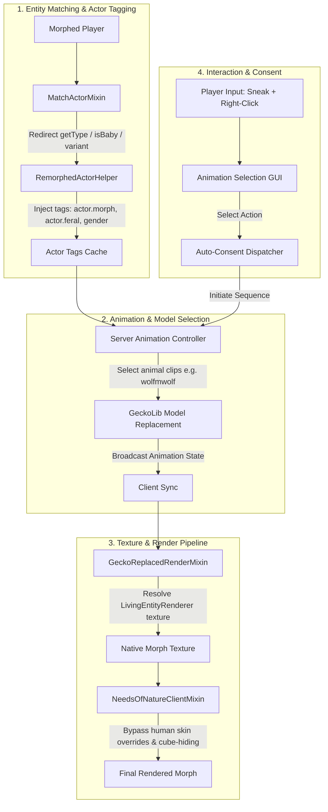

# Needs of Nature × ReMorphed Bridge (`non_remorphed_bridge`)

<div align="center">
  <a href="https://github.com/DeconstructedCube/non_remorphed_bridge/releases/latest"></a>
  <a href="https://minecraft.net/"></a>
  <a href="https://fabricmc.net/"></a>
  <a href="https://adoptium.net/"></a>
  <a href="LICENSE"></a>
</div>

---

A Fabric compatibility bridge mod providing seamless integration between **Needs of Nature (NoN)** and **ReMorphed** on Minecraft 1.21.11.

## Architecture

The bridge operates across four subsystems to connect ReMorphed's morphing state with Needs of Nature's animation and physiological systems:


```mermaid
graph TD
    subgraph EntityMatching [1. Entity Matching & Actor Tagging]
        A[Morphed Player] --> B[MatchActorMixin]
        B -->|Redirect getType / isBaby / variant| C[RemorphedActorHelper]
        C -->|Inject tags: actor.morph, actor.feral, gender| D[Actor Tags Cache]
    end

    subgraph AnimationLayer [2. Animation & Model Selection]
        D --> E[Server Animation Controller]
        E -->|Select animal clips e.g. wolfmwolf| F[GeckoLib Model Replacement]
        F -->|Broadcast Animation State| G[Client Sync]
    end

    subgraph RenderPipeline [3. Texture & Render Pipeline]
        G --> H[GeckoReplacedRenderMixin]
        H -->|Resolve LivingEntityRenderer texture| I[Native Morph Texture]
        I --> J[NeedsOfNatureClientMixin]
        J -->|Bypass human skin overrides & cube-hiding| K[Final Rendered Morph]
    end

    subgraph InteractionSystem [4. Interaction & Consent]
        L[Player Input: Sneak + Right-Click] --> M[Animation Selection GUI]
        M -->|Select Action| N[Auto-Consent Dispatcher]
        N -->|Initiate Sequence| E
    end
```

### Subsystems Breakdown

- **Entity Matching Layer**: Intercepts entity queries (`getType`, `isBaby`, `EntityVariants`) at the mixin level to supply active morph data instead of the default `minecraft:player` type, enabling proper animal animation clip selection.
- **Actor Tagging & Physiology**: Injects cached actor tags (`actor.morph`, `actor.feral`, gender traits) into NoN's physiology scanner, ensuring correct liquid donor attribution and energy management.
- **Render Pipeline**: Uses runtime render states to query native vanilla mob textures (including 1.21.11 wolf, cat, and farm animal variants) while bypassing human skin overrides and destroyed-skin cube-hiding routines.
- **Interactive Action GUI**: Displays available animation actions when interacting with compatible mobs while morphed, dispatching automated consent to bypass player-to-player waiting states.

## Requirements

- **Minecraft**: `1.21.11`
- **Fabric Loader**: `>= 0.18.2`
- **Fabric API**: `0.141.6+1.21.11`
- **Java**: `21`
- **GeckoLib**: `5.4.5` (Fabric)
- **Needs of Nature (NoN)**: `>= 1.5.0`
- **ReMorphed**: `>= 7.0.0` (along with Walkers, CraftedCore, SkinShifter)

## Building from Source

```bash
./gradlew build
```

Compiled JARs will be generated in `build/libs/`.

## License

This project is licensed under the [GNU General Public License v3.0 (GPL-3.0-or-later)](LICENSE).
