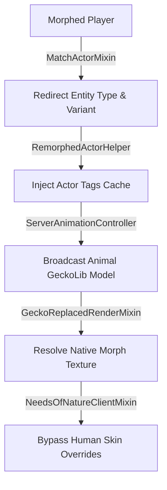

# Needs of Nature × ReMorphed Bridge (`non_remorphed_bridge`)

<div align="center">
  <a href="https://github.com/DeconstructedCube/non_remorphed_bridge/releases/latest"></a>
  <a href="https://minecraft.net/"></a>
  <a href="https://fabricmc.net/"></a>
  <a href="https://adoptium.net/"></a>
  <a href="LICENSE"></a>
</div>

---

A Fabric compatibility bridge mod providing seamless integration between **Needs of Nature (NoN)** and **ReMorphed** on Minecraft 1.21.11.

## Features

- **Entity Matching**: Intercepts `entity.getType()`, `isBaby()`, and `EntityVariants.resolveVariant()` to match the active morph rather than `minecraft:player`, ensuring appropriate animal animation clips (e.g. `p1_fox`) are selected.
- **Texture Resolution**: Resolves native morph textures directly via runtime render state (including 1.21.11 wolf, cat, and farm animal variants).
- **Render State Correction**: Bypasses NoN player skin overrides and cube-hiding routines for morphed players, avoiding human skin textures on animal geometry.
- **Actor Tags Cache**: Caches morph actor tags (`actor.morph`, `actor.feral`, gender tags) to avoid allocation overhead during tick scans.
- **Mob Action Invitation GUI**: Supports interactive action selection when interacting with compatible mobs while morphed, with automatic consent resolution.

## Architecture Pipeline


```mermaid
graph TD
    Player[Morphed Player] --> |MatchActorMixin| Type[Redirect Entity Type & Variant]
    Type --> |RemorphedActorHelper| Tags[Inject Actor Tags Cache]
    Tags --> |ServerAnimationController| Broadcast[Broadcast Animal GeckoLib Model]
    Broadcast --> |GeckoReplacedRenderMixin| Texture[Resolve Native Morph Texture]
    Texture --> |NeedsOfNatureClientMixin| Render[Bypass Human Skin Overrides]
```

## Requirements

- **Minecraft**: `1.21.11`
- **Fabric Loader**: `>= 0.18.2`
- **Fabric API**: `0.141.6+1.21.11`
- **Java**: `21`
- **GeckoLib**: `5.4.5` (Fabric)
- **Needs of Nature (NoN)**: `>= 1.5.0`
- **ReMorphed**: `>= 7.0.0` (along with Walkers, CraftedCore, SkinShifter)

## Building from Source

```bash
./gradlew build
```

Compiled JARs will be generated in `build/libs/`.

## License

This project is licensed under the [GNU General Public License v3.0 (GPL-3.0-or-later)](LICENSE).
